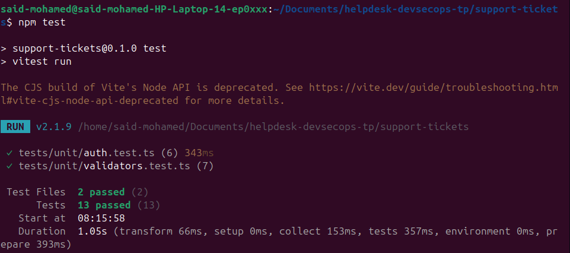
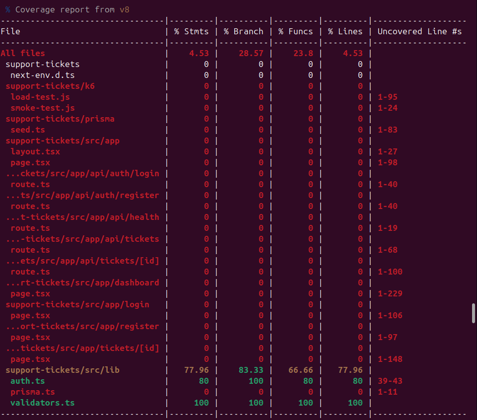
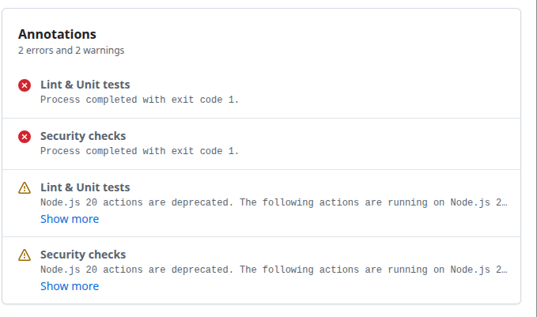

Etape 1 :

Exercice 1 : Lire le Dockerfile 

question 1 : Pourquoi utilise-t-on un multi-stage build plutôt qu'un seul FROM ?

Réponse : On utilise le multi-stage build plutot qu'un seul from car dans notre Dockerfille, on a un premier FROM pour installer tous les dépendances, ensuite on a un deuxième FROM pour construire le projet et enfin on a un troisième FROM pour exécuter le projet. Je pense que le multi-stage est utile pour essayer de réduire la taille de l'image afin de séparer les étapes de construction (dépendances et builder) avec l'étape de l'exécution.

Question 2: Que fait la ligne output: 'standalone' dans next.config.js et comment Docker l'exploite-t-elle ?

Réponse: Je pense que il se peut que ça génère un dossier à part sans dépendre à node_modules. Ensuite on ajoute cette ligne : 
COPY --from=builder /app/.next/standalone ./
Enfin il execute la commande node server.js 

Question 3: Pourquoi crée-t-on un utilisateur nextjs non-root ?

D'après certains articles, tu crées un user nextjs non-root pour éviter qu'il puisse avoir des droits sur ton code. 

Question 4 : À quoi sert HEALTHCHECK dans le Dockerfile ?

Réponse : Elle permet de surveiller l'état de l'application.

Etape 1.2 : 

Commande prévue : 

docker build -t helpdesk:dev .
docker images | grep helpdesk    # Notez la taille de l'image
docker run -d -p 3000:3000 \
  -e JWT_SECRET="$(openssl rand -base64 32)" \
  --name helpdesk-container helpdesk:dev

# Initialiser la DB dans le conteneur
docker exec helpdesk-container npx prisma migrate deploy
docker exec helpdesk-container npx tsx prisma/seed.ts

# Vérifier
curl http://localhost:3000/api/health

Réponse : l'image est crée avec une taille de 300Mo. Le statut est bien ok lorss de l'execution de la commande curl. 

Etape 1.3 : 

TOus les commandes sont executés et voici le résultat de la dernière commande.

Etape 2 : Test Unitaires

Etape 2.1 : 

J'ai effectué des executions de ces commandes prévues. voici le resultat : 

pour  la commande npm test, voici la capture

pour la commande npm run test:coverage (c'est le tableau)

Etape 2.2 : 

Ces tests servent à vérifier que les parties importantes fonctionnent correctement.  
J’ai testé la validation des données pour éviter d’accepter des informations incorrectes, comme un mot de passe vide ou un mauvais statut de ticket.

J’ai aussi ajouté un test pour vérifier qu’un token expiré est refusé, ce qui permet de sécuriser l’authentification.

Enfin, la fonction `canEditTicket` permet de gérer les droits de modification d’un ticket : un admin ou un agent peut modifier les tickets, alors qu’un utilisateur simple peut seulement modifier ses propres tickets.

Réponse pour la question: 

Si il y'a des fichiers qui sont inférieurs à 100, c'est que la couverture globale est faible parce que Vitest inclut aussi beaucoup de fichiers non testés. 

Etape 3 : Smoke Test

pour la partie 3.1 et 3.2, je l'ai exécuté. Voici les résultats sont : 

Nombre total de requêtes (http_reqs) : 5 066 requêtes envoyées, soit un rythme moyen de 506,5 requêtes/seconde.

Taux de succès (http_req_failed) : 0,00% d'échec (5 066 requêtes réussies sur 5 066). Toutes les requêtes ont retourné un code HTTP 200 OK.

Temps de réponse moyen (http_req_duration) : 1,86 ms en moyenne.

Temps de réponse au percentile 95 (p(95)) : 2,97 ms. 95% des requêtes ont mis moins de 3 millisecondes à répondre.

Partie 3.3 : 

1. Smoke Test (smoke-test.js) : Réussite (100%)Statut : Succès total sous charge minimale (1 VU pendant 10s).Métriques : 5 066 requêtes exécutées avec un taux de succès de 100% (http_req_failed = 0%).Performances : Temps de réponse excellent avec une moyenne de 1,86 ms et un $p(95)$ de 2,97 ms.2. Load Test (load-test.js) : Échec critique (Erreur 500)Statut : Bloqué dès la phase d'initialisation (setup()).Problème rencontré : La requête d'authentification (Login) échoue systématiquement en retournant une erreur interne du serveur (HTTP 500) : {"error":"Internal error"}.Impact : Le test s'arrête instantanément (0% du scénario de charge exécuté). Le script lève également une exception secondaire (TypeError: Cannot read property 'values' of undefined) à la ligne 92 car les métriques attendues pour générer le rapport final n'existent pas suite au crash du setup.

Partie 4.1 

J'ai effectué ces commandes voici le résultat 

said-mohamed@said-mohamed-HP-Laptop-14-ep0xxx:~/Documents/helpdesk-devsecops-tp/support-tickets$ npm audit 
# npm audit report

esbuild  <=0.24.2
Severity: moderate
esbuild enables any website to send any requests to the development server and read the response - https://github.com/advisories/GHSA-67mh-4wv8-2f99
fix available via `npm audit fix --force`
Will install vitest@4.1.7, which is a breaking change
node_modules/vite/node_modules/esbuild
  vite  <=6.4.1
  Depends on vulnerable versions of esbuild
  node_modules/vite
    @vitest/mocker  <=3.0.0-beta.4
    Depends on vulnerable versions of vite
    node_modules/@vitest/mocker
      vitest  0.0.1 - 0.0.12 || 0.0.29 - 0.0.122 || 0.3.3 - 3.0.0-beta.4
      Depends on vulnerable versions of @vitest/mocker
      Depends on vulnerable versions of vite
      Depends on vulnerable versions of vite-node
      node_modules/vitest
        @vitest/coverage-v8  <=2.2.0-beta.2
        Depends on vulnerable versions of vitest
        node_modules/@vitest/coverage-v8
    vite-node  <=2.2.0-beta.2
    Depends on vulnerable versions of vite
    node_modules/vite-node

glob  10.2.0 - 10.4.5
Severity: high
glob CLI: Command injection via -c/--cmd executes matches with shell:true - https://github.com/advisories/GHSA-5j98-mcp5-4vw2
fix available via `npm audit fix --force`
Will install eslint-config-next@16.2.6, which is a breaking change
node_modules/glob
  @next/eslint-plugin-next  14.0.5-canary.0 - 15.0.0-rc.1
  Depends on vulnerable versions of glob
  node_modules/@next/eslint-plugin-next
    eslint-config-next  14.0.5-canary.0 - 15.0.0-rc.1
    Depends on vulnerable versions of @next/eslint-plugin-next
    node_modules/eslint-config-next

next  9.3.4-canary.0 - 16.3.0-canary.5
Severity: high
Next Vulnerable to Denial of Service with Server Components - https://github.com/advisories/GHSA-mwv6-3258-q52c
Next has a Denial of Service with Server Components - Incomplete Fix Follow-Up - https://github.com/advisories/GHSA-5j59-xgg2-r9c4
Next.js self-hosted applications vulnerable to DoS via Image Optimizer remotePatterns configuration - https://github.com/advisories/GHSA-9g9p-9gw9-jx7f
Next.js HTTP request deserialization can lead to DoS when using insecure React Server Components - https://github.com/advisories/GHSA-h25m-26qc-wcjf
Next.js: HTTP request smuggling in rewrites - https://github.com/advisories/GHSA-ggv3-7p47-pfv8
Next.js: Unbounded next/image disk cache growth can exhaust storage - https://github.com/advisories/GHSA-3x4c-7xq6-9pq8
Next.js has a Denial of Service with Server Components - https://github.com/advisories/GHSA-q4gf-8mx6-v5v3
Next.js Vulnerable to Denial of Service with Server Components - https://github.com/advisories/GHSA-8h8q-6873-q5fj
Next.js's Middleware / Proxy redirects can be cache-poisoned - https://github.com/advisories/GHSA-3g8h-86w9-wvmq
Next.js vulnerable to cross-site scripting in App Router applications using CSP nonces - https://github.com/advisories/GHSA-ffhc-5mcf-pf4q
Next.js vulnerable to cache poisoning via collisions in React Server Component cache-busting - https://github.com/advisories/GHSA-vfv6-92ff-j949
Next.js has cross-site scripting in beforeInteractive scripts with untrusted input - https://github.com/advisories/GHSA-gx5p-jg67-6x7h
Next.js has a Denial of Service in the Image Optimization API - https://github.com/advisories/GHSA-h64f-5h5j-jqjh
Next.js vulnerable to server-side request forgery in applications using WebSocket upgrades - https://github.com/advisories/GHSA-c4j6-fc7j-m34r
Next.js vulnerable to cache poisoning in React Server Component responses - https://github.com/advisories/GHSA-wfc6-r584-vfw7
Next.js has a Middleware / Proxy bypass in Pages Router applications using i18n - https://github.com/advisories/GHSA-36qx-fr4f-26g5
Depends on vulnerable versions of postcss
fix available via `npm audit fix --force`
Will install next@16.2.6, which is a breaking change
node_modules/next

postcss  <8.5.10
Severity: moderate
PostCSS has XSS via Unescaped </style> in its CSS Stringify Output - https://github.com/advisories/GHSA-qx2v-qp2m-jg93
fix available via `npm audit fix --force`
Will install next@16.2.6, which is a breaking change
node_modules/next/node_modules/postcss

11 vulnerabilities (7 moderate, 4 high)

To address all issues (including breaking changes), run:
  npm audit fix --force
said-mohamed@said-mohamed-HP-Laptop-14-ep0xxx:~/Documents/helpdesk-devsecops-tp/support-tickets$ npm audit --audit-level=high
# npm audit report

esbuild  <=0.24.2
Severity: moderate
esbuild enables any website to send any requests to the development server and read the response - https://github.com/advisories/GHSA-67mh-4wv8-2f99
fix available via `npm audit fix --force`
Will install vitest@4.1.7, which is a breaking change
node_modules/vite/node_modules/esbuild
  vite  <=6.4.1
  Depends on vulnerable versions of esbuild
  node_modules/vite
    @vitest/mocker  <=3.0.0-beta.4
    Depends on vulnerable versions of vite
    node_modules/@vitest/mocker
      vitest  0.0.1 - 0.0.12 || 0.0.29 - 0.0.122 || 0.3.3 - 3.0.0-beta.4
      Depends on vulnerable versions of @vitest/mocker
      Depends on vulnerable versions of vite
      Depends on vulnerable versions of vite-node
      node_modules/vitest
        @vitest/coverage-v8  <=2.2.0-beta.2
        Depends on vulnerable versions of vitest
        node_modules/@vitest/coverage-v8
    vite-node  <=2.2.0-beta.2
    Depends on vulnerable versions of vite
    node_modules/vite-node

glob  10.2.0 - 10.4.5
Severity: high
glob CLI: Command injection via -c/--cmd executes matches with shell:true - https://github.com/advisories/GHSA-5j98-mcp5-4vw2
fix available via `npm audit fix --force`
Will install eslint-config-next@16.2.6, which is a breaking change
node_modules/glob
  @next/eslint-plugin-next  14.0.5-canary.0 - 15.0.0-rc.1
  Depends on vulnerable versions of glob
  node_modules/@next/eslint-plugin-next
    eslint-config-next  14.0.5-canary.0 - 15.0.0-rc.1
    Depends on vulnerable versions of @next/eslint-plugin-next
    node_modules/eslint-config-next

next  9.3.4-canary.0 - 16.3.0-canary.5
Severity: high
Next Vulnerable to Denial of Service with Server Components - https://github.com/advisories/GHSA-mwv6-3258-q52c
Next has a Denial of Service with Server Components - Incomplete Fix Follow-Up - https://github.com/advisories/GHSA-5j59-xgg2-r9c4
Next.js self-hosted applications vulnerable to DoS via Image Optimizer remotePatterns configuration - https://github.com/advisories/GHSA-9g9p-9gw9-jx7f
Next.js HTTP request deserialization can lead to DoS when using insecure React Server Components - https://github.com/advisories/GHSA-h25m-26qc-wcjf
Next.js: HTTP request smuggling in rewrites - https://github.com/advisories/GHSA-ggv3-7p47-pfv8
Next.js: Unbounded next/image disk cache growth can exhaust storage - https://github.com/advisories/GHSA-3x4c-7xq6-9pq8
Next.js has a Denial of Service with Server Components - https://github.com/advisories/GHSA-q4gf-8mx6-v5v3
Next.js Vulnerable to Denial of Service with Server Components - https://github.com/advisories/GHSA-8h8q-6873-q5fj
Next.js's Middleware / Proxy redirects can be cache-poisoned - https://github.com/advisories/GHSA-3g8h-86w9-wvmq
Next.js vulnerable to cross-site scripting in App Router applications using CSP nonces - https://github.com/advisories/GHSA-ffhc-5mcf-pf4q
Next.js vulnerable to cache poisoning via collisions in React Server Component cache-busting - https://github.com/advisories/GHSA-vfv6-92ff-j949
Next.js has cross-site scripting in beforeInteractive scripts with untrusted input - https://github.com/advisories/GHSA-gx5p-jg67-6x7h
Next.js has a Denial of Service in the Image Optimization API - https://github.com/advisories/GHSA-h64f-5h5j-jqjh
Next.js vulnerable to server-side request forgery in applications using WebSocket upgrades - https://github.com/advisories/GHSA-c4j6-fc7j-m34r
Next.js vulnerable to cache poisoning in React Server Component responses - https://github.com/advisories/GHSA-wfc6-r584-vfw7
Next.js has a Middleware / Proxy bypass in Pages Router applications using i18n - https://github.com/advisories/GHSA-36qx-fr4f-26g5
Depends on vulnerable versions of postcss
fix available via `npm audit fix --force`
Will install next@16.2.6, which is a breaking change
node_modules/next

postcss  <8.5.10
Severity: moderate
PostCSS has XSS via Unescaped </style> in its CSS Stringify Output - https://github.com/advisories/GHSA-qx2v-qp2m-jg93
fix available via `npm audit fix --force`
Will install next@16.2.6, which is a breaking change
node_modules/next/node_modules/postcss

11 vulnerabilities (7 moderate, 4 high)

To address all issues (including breaking changes), run:
  npm audit fix --force

Je sais que ça fait beaucoup de lignes mais je ne pouvais pas prendre tout en capture d'écran car ça allait minuscule. 

Etape 5 

Voici le résultat obtenu lorsque on clique sur github Actions 

Etape 6 

Je n'ai pas réussi à setup et configurer malgré les consignes et j'essayais de tout sans IA. SI tu remarques que j'ai fait avec IA, je suis d'accord pour les points perdus. 